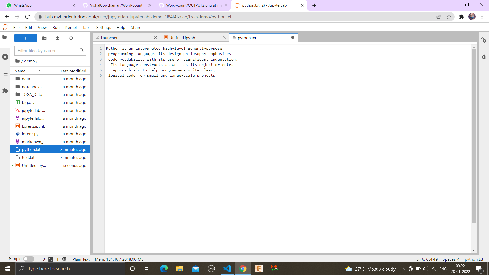
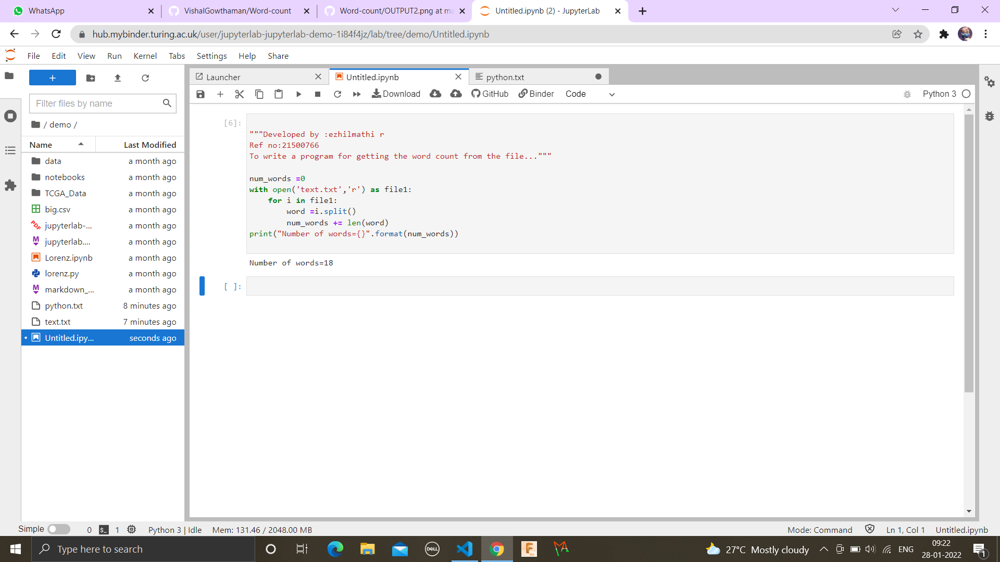

# Word-count
## AIM:
To write a python program for getting the word count from a text file.
## EQUIPEMENT'S REQUIRED: 
PC
Anaconda - Python 3.7
## ALGORITHM: 
### Step 1:
Assign a variable for value  zero

### Step 2: 
 Open then required file by using the function"with"

### Step 3: 
 Then use the laptop to assign the i value in the file.

### Step 4:  
Using split function to split the words.

### Step 5: 
Finding the length of the words by using len() function.

### Step 6: 
Calling the function and printing the number of words.

## PROGRAM:
```

"""Developed by :ezhilmathi r
Ref no:21500766
To write a program for getting the word count from the file..."""

num_words =0
with open('text.txt','r') as file1:
    for i in file1:
        word =i.split()
        num_words += len(word)
print("Number of words={}".format(num_words))

```

### OUTPUT:





## RESULT:
Thus the program is written to find the word count from a text.
